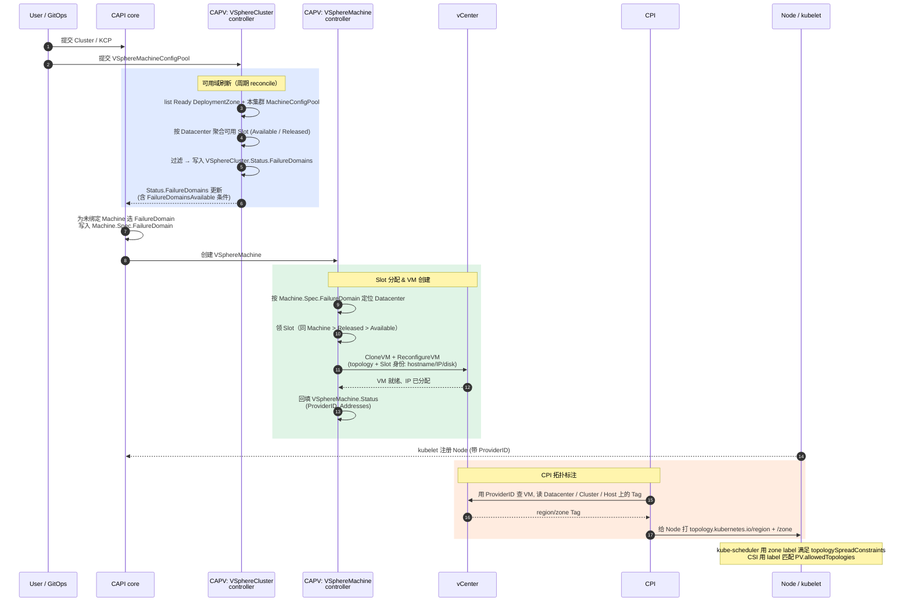

# vSphere FailureDomain 使用指南与 VSphereMachineConfigPool 协同设计

本文档面向不了解 VMware 故障域的开发和运维人员，介绍 Cluster API Provider vSphere (CAPV) 中故障域的架构设计、工作流程、vCenter Tag 管理。

文档后半部分还会介绍 CAPV 在标准故障域之上新增的 **VSphereMachineConfigPool** 资源，它为虚拟机预分配固定的主机名、IP 地址和持久化磁盘（Slot），与 FailureDomain 协同工作，共同解决节点"分布"与"身份稳定"两个正交问题，同时保留节点拓扑标签，让 workload 依旧能按 Zone 做调度。

> 💡 阅读过程中遇到不熟悉的术语（如 CAPI / CAPV / ComputeCluster / HostGroup / Tag Category / ResourcePool / Slot 等），可随时跳到文末的 **§五 术语速查** 查看解释。术语按"k8s/CAPI 生态"、"vSphere 原生"、"CAPV 故障域特有"三类组织。

---

## 一、概述与背景

### 1.1 什么是故障域

故障域 (Failure Domain) 是基础设施中的一个隔离边界。在同一个故障域内的资源可能会因为同一个故障（如电源故障、网络中断）而同时不可用。将工作负载分布到不同的故障域，可以确保单点故障不影响整体服务的可用性。

在公有云中，故障域通常是预定义的"可用区"(Availability Zone)。而 vSphere 没有原生的 Region/Zone 概念，CAPV 通过 **vCenter Tag** 机制在物理基础设施之上构建逻辑拓扑，实现与公有云类似的故障域能力。

### 1.2 vSphere 基础设施层级

在理解故障域之前，需要先了解 vSphere 的对象层级：

```
vCenter Server
  └── Datacenter (数据中心)
        ├── host (主机文件夹，小写；仅分类用)
        │     ├── ComputeCluster (ClusterComputeResource)
        │     │     ├── ResourcePool (根池 "Resources"，可嵌套子池)
        │     │     ├── Host-1 (HostSystem) ─┐
        │     │     ├── Host-2 (HostSystem) ─┤  VM 实际运行在
        │     │     ├── Host-3 (HostSystem) ─┤  某台 Host 上
        │     │     └── Host-4 (HostSystem) ─┘
        │     │           （HostGroup-A = {Host-1, Host-2}、
        │     │            HostGroup-B = {Host-3, Host-4}：
        │     │            HostGroup 不是独立 inventory 对象，
        │     │            只是 Cluster DRS 配置里的分组）
        │     └── Host (独立主机，未加入任何 Cluster)
        │           └── ResourcePool
        ├── vm (虚拟机文件夹) → Folder → VM
        ├── datastore (数据存储文件夹) → Datastore
        └── network (网络文件夹) → Network
```

CAPV 中的故障域可以映射到上述层级中的 **Datacenter**、**ComputeCluster** 或 **HostGroup**，粒度由大到小。HostGroup 虽然不出现在 inventory 树中（它是 Cluster 的 DRS 配置），但 CAPV 会把 Zone Tag 打在组内的每台 Host 上——详见 §1.3。

### 1.3 Host、ComputeCluster 与 HostGroup 的区别

这三个概念容易混淆，以下从层级关系、功能定位和故障域角色三个维度进行对比：

| | **Host (ESXi 主机)** | **ComputeCluster (计算集群)** | **HostGroup (主机组)** |
|---|---|---|---|
| **是什么** | 运行 ESXi 虚拟化程序的物理服务器，是实际承载 VM 的计算资源 | 多台 ESXi 主机的逻辑集合，统一管理和调度资源 | ComputeCluster 内部的一个主机子集分组，是 DRS 的逻辑概念 |
| **层级关系** | vSphere 最底层的计算单元 | 包含一组 Host，位于 Datacenter 下 | **必须属于某个 ComputeCluster**，是其中部分 Host 的分组，不能独立于 Cluster 存在 |
| **管理能力** | 独立运行 VM，但没有 DRS、HA 等高级调度能力（这些是 Cluster 级功能） | 提供 HA（高可用）、DRS（分布式资源调度）、vMotion（在线迁移）等集群级功能 | 本身不提供独立管理能力，依赖所在 ComputeCluster 的 DRS 进行 VM 放置 |
| **资源隔离** | 物理隔离——不同主机是不同的物理机器 | 逻辑隔离——不同集群有独立的资源池和调度策略 | 通过 DRS VM-Host 亲和规则把 VM 约束到主机子集；强度为 `must` 还是 `should` 由运维在 vCenter 上配置，CAPV 不干预 |
| **故障域角色** | 本身不是 `VSphereFailureDomain.spec.zone.type` 的取值，但在 HostGroup 场景下 Zone 标签物理上附加到组内的每台 Host (`HostSystem`) 上 | 可作为 Zone（常见）或 Region | 只能作为 Zone，且必须配合 VM-Host 亲和规则使用 |
| **vSphere 对象类型** | `HostSystem` | `ClusterComputeResource` | 非独立 vSphere 对象，是 Cluster DRS 配置的一部分 |

> 类比：ComputeCluster 像不同的办公楼，各自有独立的物业管理和门禁；HostGroup 像同一栋楼内的不同楼层，共享物业，只是逻辑上划了区。

HostGroup 不是独立的 vSphere 对象（只是 Cluster DRS Group 配置），因此 CAPV 的 HostGroup 故障域会把 Zone Tag 打在组内的**每台 Host** 上，并且依赖 VMGroup + VM-Host 亲和规则生效。

---

## 二、架构设计

### 2.1 CRD 资源模型

CAPV 通过三种资源协同工作来实现故障域：

#### VSphereFailureDomain（集群级别资源）

定义"什么是一个故障域"。包含三个核心部分：

下面是"Region = Datacenter, Zone = ComputeCluster"（§2.3 场景一）的完整示例，值都是占位性的、可替换成真实环境的对应名称：

```yaml
apiVersion: infrastructure.cluster.x-k8s.io/v1beta1
kind: VSphereFailureDomain
metadata:
  name: fd-bj-cluster-a                  # 集群级资源，不需要 namespace
spec:
  region:                                # Region 定义
    name: region-bj                      # vCenter Tag 名称（"值"）
    type: Datacenter                     # Datacenter | ComputeCluster
                                         # （不允许 HostGroup：HostGroup 是 Cluster 内部的最细粒度，
                                         #   若作为 Region，Zone 在其下再无更细的切分层次可用）
    tagCategory: k8s-region              # vCenter Tag Category 名称（"键"）
  zone:                                  # Zone 定义（结构同上）
    name: zone-cluster-a
    type: ComputeCluster                 # Datacenter | ComputeCluster | HostGroup
    tagCategory: k8s-zone
  topology:                              # 实际的 vSphere 基础设施
    datacenter: dc-bj-1                  # (必填) Datacenter 名称
    computeCluster: cluster-a            # (可选) ComputeCluster 名称；Zone/Region=ComputeCluster 或 HostGroup 时必填
    # hosts:                             # (可选) 仅 HostGroup 故障域需要；运维需预先在 vCenter Cluster DRS 里建好下面的两个 group 及绑定它们的 VM-Host Affinity Rule
    #   vmGroupName: vmg-a               # 容器需预创建（可为空 group）；CAPV 会自动把新建 VM Add 进来
    #   hostGroupName: hg-a              # 容器 + 成员 Host 都需预配置好；CAPV 不会增删 Host
    networks:                            # (可选) 简化的网络名列表
      - VM Network
    # networkConfigurations:             # (可选) 详细网络配置，与 networks 二选一；需要 DHCP/静态 IP/DNS 等精细控制时用
    datastore: shared-ds-bj-1            # (可选) Datastore 名称或 inventory path
```

> **`tagCategory` 与 `name` 的关系**：可类比 k8s label 的 key/value——`tagCategory` 是 Category（键），`name` 是该 Category 下的 Tag（值）。上例最终会在 vCenter 创建 `k8s-region/region-bj` 与 `k8s-zone/zone-cluster-a` 两组 Category+Tag，并分别 attach 到 `dc-bj-1` 数据中心和 `cluster-a` 计算集群上。

#### VSphereDeploymentZone（集群级别资源）

定义"如何使用一个故障域"。将上面的 `fd-bj-cluster-a` 与具体的放置约束绑定，并通过 label 供 VSphereCluster 选择：

```yaml
apiVersion: infrastructure.cluster.x-k8s.io/v1beta1
kind: VSphereDeploymentZone
metadata:
  name: dz-bj-cluster-a                                       # Machine.spec.failureDomain 填的就是这个名字
  labels:
    env: production                                            # 供 VSphereCluster.failureDomainSelector 匹配
spec:
  server: "vcenter.example.com"                              # vCenter 地址
  failureDomain: "fd-bj-cluster-a"                           # 引用上面定义的 VSphereFailureDomain
  controlPlane: true                                          # 是否用于控制平面节点
  placementConstraint:
    resourcePool: "/dc-bj-1/host/cluster-a/Resources/my-pool" # ResourcePool 的 inventory path（见 §五 术语速查）
    folder: "/dc-bj-1/vm/my-folder"                           # VM Folder 的 inventory path
```

#### VSphereCluster.spec.failureDomainSelector

通过标签选择器关联部署区域——下例会命中上面的 `dz-bj-cluster-a`：

```yaml
spec:
  failureDomainSelector:
    matchLabels:
      env: production
```

- `nil`（不设置）: 禁用故障域——`VSphereCluster.Status.FailureDomains` 保持为空，CAPI 调度时给 Machine 留空 `spec.failureDomain`，Machine 按默认放置（不做跨域打散）
- `{}`（空选择器）: 选择所有 VSphereDeploymentZone
- 设置标签选择器: 仅选择匹配的 VSphereDeploymentZone

### 2.2 资源关系

```
VSphereCluster                         VSphereMachineConfigPool（可选）
  │                                      │  spec.clusterRef  → 本 Cluster
  │  spec.failureDomainSelector           │  spec.configs[]   → Slot（hostname/IP/disk）
  │         │                            │  每个 Slot 有 datacenter
  │         ▼                            │
  │   ┌─────────────────────┐      ┌─────────────────────┐
  │   │ VSphereDeploymentZone│─────▶│ VSphereFailureDomain │
  │   │  - server            │      │  - region (tag)      │
  │   │  - placementConstraint│      │  - zone (tag)        │
  │   │  - controlPlane      │      │  - topology          │
  │   └─────────────────────┘      └─────────────────────┘
  │
  │   ┌─────────────────────┐      ┌─────────────────────┐
  │   │ VSphereDeploymentZone│─────▶│ VSphereFailureDomain │
  │   └─────────────────────┘      └─────────────────────┘
  │
  ▼
CAPI Machine                         VSphereMachine
  │  spec.failureDomain =              │  领取同 Datacenter 下的 Slot
  │  "VSphereDeploymentZone 名称"       │  （若关联了 ConfigPool）
  ▼                                    ▼
VSphereVM（按 故障域 topology + Slot 身份 创建 VM）
```

> `VSphereMachineConfigPool` 是**可选**资源（图中与 VSphereMachine 之间的连线可理解为虚线）。未关联配置池时，VM 身份由模板动态生成（标准 CAPV 行为）；关联后，Slot 过滤会参与故障域上报（见 §四）。

### 2.3 两种拓扑场景

#### 场景一：Region = Datacenter, Zone = ComputeCluster

适用于：需要将节点分布到不同计算集群。**默认形态是"单 Datacenter + 多 ComputeCluster"**——一个 Datacenter 内挂多个 Cluster，故障域之间共享数据中心级网络与存储。这也是 CPI/CSI 会自动给 Node 打上 `topology.kubernetes.io/region` / `zone` 标签的最常见拓扑。

```
Datacenter (dc-1)          ← Region 标签打在这里
  ├── Cluster (cluster-a)  ← Zone 标签打在这里
  └── Cluster (cluster-b)  ← Zone 标签打在这里
```

> ⚠️ **跨 Datacenter 是高级场景，不是默认推荐**。理论上 CAPV 允许把 FD 分布到多个 Datacenter，但需要事先满足大量额外前提，任何一项不满足都可能导致集群不可用：
> - **网络互通**：两个 DC 之间的 Pod / Node / Service 网络要打通（CNI 支持跨 DC、MTU 一致、防火墙放行）；
> - **VIP 跨 DC 可达**：kube-apiserver VIP 和 Ingress 入口 VIP 必须能在两侧解析并访问——通常靠外部四层 LB（F5、HAProxy）或 BGP/ECMP 宣告同一 VIP；
> - **VM Template**：vSphere Template 不跨 DC，每个 DC 都要预置**同名同版本**的 Template；
> - **Datastore**：每个 DC 各自要有可用 Datastore，跨 DC 不能依赖同一份共享存储；
> - **CPI / CSI**：`vsphere.conf` 要枚举所有 vCenter / Datacenter，`StorageClass.allowedTopologies` 必须按 Zone 显式约束，否则 PV 可能被绑到错误 DC；
> - **运维编排**：升级、备份、监控、告警都要按多 DC 模型重做。
>
> 这些都不归 CAPV 管，需与网络 / 存储 / SRE 团队充分对齐再上线。**没有上述前提的环境，建议先用单 DC 多 ComputeCluster，跨 DC 留在路线图里。**

#### 场景二：Region = ComputeCluster, Zone = HostGroup

适用于：单个计算集群内按主机组（可理解为机柜/机架级故障隔离单元）划分，所有主机共享同一存储。

```
Cluster (cluster-1)             ← Region 标签打在这里
  ├── HostGroup (hg-a)
  │     ├── Host-1              ← Zone 标签打在 Host 上
  │     └── Host-2
  └── HostGroup (hg-b)
        ├── Host-3              ← Zone 标签打在 Host 上
        └── Host-4
```

### 2.4 vCenter 预置要求：谁建什么

为避免"哪些要手工建、哪些 CAPV 会建"的混淆，下表逐对象列出**运维预置**与 **CAPV 自动操作**的边界。一句话总结：**vSphere 基础设施 + DRS 分组容器 + 亲和规则需要运维手动建；Tag 体系、VMGroup 成员关系和 VM 本身由 CAPV 自动管理**。

| 对象 / 能力 | 运维需提前创建 | CAPV 在此对象上的操作 |
|---|---|---|
| Datacenter | ✅ | 只读引用（`topology.datacenter`） |
| ComputeCluster | ✅ | 只读引用（`topology.computeCluster`） |
| ESXi Host (`HostSystem`) | ✅ | 只读引用；**HostGroup 故障域下自动 attach Zone Tag** |
| Datastore | ✅ | 只读引用（`topology.datastore`） |
| Network (Port Group) | ✅ | 只读引用（`topology.networks` / `networkConfigurations`） |
| Folder（VM 文件夹） | ✅ | 只读引用（`placementConstraint.folder` 必须指向已存在的 Folder） |
| ResourcePool（含子池） | ✅ | 只读引用（`placementConstraint.resourcePool` 必须指向已存在的池） |
| VM Template | ✅ | 只读引用，作为 `CloneVM` 的源镜像 |
| **HostGroup**（容器 + Host 成员） | ✅（仅 HostGroup 故障域场景） | 只读——用 `ListHostsFromGroup` 取成员后给每台 Host 打 Zone Tag；不会增删 Host |
| **VMGroup**（容器） | ✅（仅 HostGroup 故障域场景，**可以是空 group**） | **自动把新建 VM Add 成员**（`reconcileVMGroupInfo`，见 `pkg/services/govmomi/service.go:1046`） |
| **VM-Host Affinity Rule** | ✅（仅 HostGroup 故障域场景；运维选 `must run on` / `should run on` 强度） | 只 `VerifyAffinityRule` 存在性，不创建、不修改强度 |
| Tag Category | ❌ | **自动创建**（VSphereDeploymentZone 控制器；基数固定 `SINGLE`，associable type 按故障域 `type` 设置）；若同名 Category 已存在但 associable type 不匹配，CAPV 会 **`UpdateCategory`** 修正 |
| Tag | ❌ | **自动创建**（按 `region.name` / `zone.name`） |
| Tag attach 到 Datacenter / ComputeCluster / Host | ❌ | **自动 attach** 到对应对象 |
| Virtual Machine | ❌ | **自动 `CloneVM` + `ReconfigureVM`**：从 Template 克隆，按 `topology` + `placementConstraint` 决定落点，按 Slot（如有 ConfigPool）下发 hostname/IP/磁盘 |

> 表中所有 ✅ 行如果对象不存在，CAPV reconcile 会失败并卡住（例如 VMGroup 不存在时 `FindVMGroup` 直接返回 `cannot find VM group <name>`），不会替你"先建后用"。

---

## 三、vCenter Tag 管理

### 3.1 Tag 系统概念

vCenter 的 Tag 系统由两层组成：

- **Tag Category (标签类别)**: 标签的分组容器。每个类别定义：
  - 名称（如 `k8s-region`、`k8s-zone`）
  - 可关联的对象类型（Datacenter、ClusterComputeResource、HostSystem）
  - **基数**：`SINGLE` 表示同一对象在该类别下最多挂一个 Tag，`MULTIPLE` 表示可挂多个。CAPV 创建 Category 时固定用 `SINGLE`——一个 Datacenter/Cluster/Host 不允许同时属于两个 Region 或两个 Zone。
- **Tag (标签)**: 属于某个类别的具体标签值（如 `region-east`、`zone-cluster-a`）

标签可以附加 (attach) 到 vSphere 对象上。**Tag Category、Tag 以及它们到目标对象的 attach 关系全部由 VSphereDeploymentZone 控制器自动创建**——运维只需在 `VSphereFailureDomain` 里写好 `tagCategory` 和 `name`；如果同名 Category 已存在但 associable type 不匹配，CAPV 会就地 Update 修正。

### 3.2 Tag 与故障域类型的对应关系

| 故障域类型 | 标签附加的对象类型 | vSphere 对象 |
|-----------|-------------------|-------------|
| `Datacenter` | Datacenter | 数据中心 |
| `ComputeCluster` | ClusterComputeResource | 计算集群 |
| `HostGroup` | HostSystem | ESXi 主机 |

### 3.3 用 govc 验证标签

Tag Category 和 Tag 由 VSphereDeploymentZone 控制器自动创建、attach，不需要手动操作。以下 [govc](https://github.com/vmware/govmomi/tree/main/govc) 命令用于验证或排查：

```bash
export GOVC_URL="https://vcenter.example.com/sdk"
export GOVC_USERNAME="administrator@vsphere.local"
export GOVC_PASSWORD="..."
export GOVC_INSECURE=true   # 自签证书

govc tags.ls                               # 列出全部 Tag
govc tags.attached.ls k8s-region/region-bj # 正向查询：某个 Tag 被 attach 到哪些对象
govc tags.attached.ls -r /dc-bj-1          # -r 为 reverse，反向查询：某个对象上附了哪些 Tag
```

控制器创建 Category 时会按下表设置 associable type：

| FailureDomain type | vSphere 对象类型 |
|---------------------|-------------------------|
| `Datacenter` | `Datacenter` |
| `ComputeCluster` | `ClusterComputeResource` |
| `HostGroup` | `HostSystem` |

### 3.4 Tag 与 CPI/CSI 的关系

CAPV、CPI、CSI 共用同一套 Tag。CPI 根据 VM 所在 vSphere 对象上的 Tag 给 Kubernetes Node 打上 `topology.kubernetes.io/region` 和 `topology.kubernetes.io/zone` 标签；CSI `allowedTopologies` 和 kube-scheduler 的 `topologySpreadConstraints` 依此生效。

CPI 配置文件 `vsphere.conf`（通常以 ConfigMap 形式随 cloud-provider-vsphere 部署，**不归 CAPV 管**，需在 CPI 侧独立维护）中的 `Labels.region/zone` 必须与 VSphereFailureDomain 的 `tagCategory` 一致，否则 CPI 找不到 Tag，Node 就拿不到 `topology.kubernetes.io/*` 标签：

```ini
[Labels]
region = k8s-region     # = VSphereFailureDomain.spec.region.tagCategory
zone   = k8s-zone       # = VSphereFailureDomain.spec.zone.tagCategory
```

---

## 四、VSphereMachineConfigPool 与故障域的协同

**VSphereMachineConfigPool**（下文称"配置池"）是 CAPV 的另一个资源，为每台 VM 预分配固定的主机名、IP、持久化磁盘（一份"节点身份"称为 **Slot**）。完整设计见 [docs/proposal/20260330-machine-config-pool.md](proposal/20260330-machine-config-pool.md)；本章只讨论它与故障域的协同。

### 4.1 二者解决什么问题，为什么要协同

| 资源 | 解决的问题 | 关键字段 |
|------|-----------|---------|
| **VSphereFailureDomain + DeploymentZone** | 节点**物理分布**：把 Machine 打散到不同 ComputeCluster/HostGroup，单点故障不影响整体 | `topology.datacenter`、`placementConstraint.resourcePool` |
| **VSphereMachineConfigPool** | 节点**身份稳定**：Machine 重建时保留原 IP、主机名、磁盘数据，支持 `maxSurge=0` 滚动升级 | `configs[].hostname/network/persistentDisks`、`configs[].datacenter` |

两者本来独立，但在 **Datacenter** 这一维度耦合：故障域的 VM 必须落在 `topology.datacenter`，Slot 也绑定 Datacenter。**如果某 Datacenter 的 Slot 全部 `InUse`，而故障域仍被上报给 CAPI，Machine 就会被调度到该域、然后卡在"VSphereMachine 领不到 Slot"——CAPI 看不到底层 vSphere 的资源状态，是调度死结的根因。**

### 4.2 解决方案：Slot 余量作为故障域可调度性的信号

> Slot 有三种状态：`Available`（从未被占用的新身份）、`InUse`（当前被某台 Machine 使用）、`Released`（使用者已删除、身份保留以待重建复用）。`Available` + `Released` 视为可调度余量。

CAPV 的做法是在上报 `VSphereCluster.Status.FailureDomains` 前，先用配置池的 Slot 余量过滤一次：

1. 列出匹配 `failureDomainSelector` 的 Ready DeploymentZone
2. 扫描本集群（按 `clusterRef` 匹配）的所有配置池，按 Datacenter 聚合可用 Slot（`Available` + `Released` 算可用，`InUse` 不算）
3. 对每个候选域：其 `topology.datacenter` 在可用集合中 → 上报，否则排除
4. 若所有域都被排除，把 `FailureDomainsAvailable=False` / Reason `ExhaustedByMachineConfigPool` 写到 Status

这样：**只有部分**故障域的 Slot 耗尽时，CAPV 会从上报结果里排除这些域，降低 Machine 被调度到无 Slot 域的概率；**所有**域都耗尽时，CAPV 会保留全部 ready domains 并通过 `FailureDomainsAvailable=False` / Reason `ExhaustedByMachineConfigPool` 暴露容量耗尽，此时新 Machine 仍可能因无 Slot 而创建失败（卡在 `MachineConfigPoolReady=False`），需要外部扩容 ConfigPool 或等待 `Released` Slot 复用。

> ⚠️ **粒度限制：cluster-aware，不是 pool-aware**。上面第 2 步按 Datacenter 聚合时**不区分 Slot 属于哪个 Pool / Consumer**，所以即便 Pool 与 KCP/MD 是 1:1 绑定，"KCP-Pool 只有 DC-1 Slot、MD-Pool 只有 DC-2 Slot"的场景仍会让聚合结果显示两 DC 都可用，KCP Machine 可能被分到 DC-2 后卡死。根因是 `VSphereCluster.Status.FailureDomains` 是集群级单一列表，CAPI 没有"按 consumer 投影 FD"的 API，**真正做到 pool-aware 必须改 CAPI**。运维侧的近似手段：让各 Pool 的 Slot 覆盖**互不相交的 Datacenter**，并用 `VSphereDeploymentZone.spec.controlPlane` 严格区分控制面/工作节点的 FD；卡死时靠 MachineHealthCheck 兜底重建。

### 4.3 配置池示例

仅为让读者看到字段形状，详见 proposal：

```yaml
apiVersion: infrastructure.cluster.x-k8s.io/v1beta1
kind: VSphereMachineConfigPool
metadata: { name: cp-pool, namespace: default }
spec:
  clusterRef: { name: my-cluster, namespace: default }
  datacenter: dc-bj-1
  configs:
    - hostname: cp-node-1
      datacenter: dc-bj-1
      network:
        primary: { networkName: VM Network, ip: 10.0.1.11/24, gateway: 10.0.1.1 }
      persistentDisks:
        - { name: etcd-data, sizeGiB: 50, mountPath: /var/lib/etcd }
    - hostname: cp-node-2
      # ...
```

### 4.4 端到端时序

集群上线后一次完整交互，涵盖"可用域上报 → Machine 分配 → VM 创建 → Node 加入 → 拓扑标签"全链路。主要角色：

- **User / GitOps**：提交 `Cluster` / `KubeadmControlPlane` / `VSphereMachineConfigPool` 等 CR
- **CAPV - VSphereCluster controller**：聚合 Slot 余量，维护 `Status.FailureDomains`，把可用域上报给 CAPI
- **CAPI core**：核心调度器，**读取 CAPV 上报的可用域**后，给 Machine 分配 FailureDomain
- **CAPV - VSphereMachine controller**：领 Slot、创建 VM
- **vCenter**：vSphere 基础设施，承载 VM 和 Tag
- **CPI**（cloud-provider-vsphere）：把 vCenter Tag 翻译成 Node 拓扑标签
- **Node / kubelet**：VM 内的 kubelet 向 CAPI 注册 Node，并接收 CPI 写入的拓扑标签



几条贯穿始终的边：
- **CAPV → CAPI 的可用域通道**：`VSphereCluster.Status.FailureDomains` 是唯一通道。CAPV 控制器周期性 reconcile，随 Slot 状态动态增减条目；CAPI 调度器每次调度都读最新值。
- **故障域 ↔ Slot 的一致性**：VSphereMachine 只在 Machine 的 FailureDomain 指向的 Datacenter 里挑 Slot；故障域与 Slot 的 Datacenter 不可分离。
- **CPI 的拓扑标签来源**：**不是**来自 Machine / VSphereMachine，而是 CPI 自己用 ProviderID 回查 vCenter，读 VM 所在对象上的 Tag。所以 `vsphere.conf` 的 `Labels.region/zone` 必须与 `VSphereFailureDomain.spec.*.tagCategory` 一致（见 §3.4），否则 Node 拿不到 zone label，`topologySpreadConstraints` 会失效。

### 4.5 可观测：看一眼就知道状态

```bash
# CAPV 当前上报给 CAPI 的可用域 + 原因
kubectl describe vspherecluster my-cluster  # 看 FailureDomainsAvailable 条件

# Machine 被分到哪个域
kubectl get machines -o custom-columns=NAME:.metadata.name,FD:.spec.failureDomain

# CPI 是否已按预期给 Node 打上 zone label
kubectl get nodes -L topology.kubernetes.io/zone

# Slot 当前状态
kubectl get vspheremachineconfigpool -o yaml   # status.configStatuses[].state
```

### 4.6 边界情况

- **未关联配置池**：跳过 Slot 过滤，等同标准 CAPV——所有 Ready 的 DeploymentZone 直接上报。配置池是**可选增强**。
- **单池多 Datacenter**：Slot 级 `datacenter` 覆盖 pool 级默认，一个池就能承载跨 Datacenter 部署，`fd-dc1` 的 Machine 只能领到 `datacenter=dc1` 的 Slot，互不干扰。⚠️ 仅讨论 Slot 分配机制，是否能实际用起来取决于 §2.3 场景一注释中列出的跨 DC 前提（网络 / VIP / Template / Datastore / CPI/CSI）是否满足。
- **HostGroup 场景（§2.3 场景二）**：HostGroup 必须属于单个 ComputeCluster，而 ComputeCluster 又属于单个 Datacenter，所以此场景下**所有 Slot 天然同在一个 Datacenter**——按 Datacenter 聚合的过滤粒度退化为"池空 / 池非空"，无法区分 HostGroup。若需要 HostGroup 之间独立的容量配额，要拆分成多个配置池及其消费者（一个池只能绑定一个 KCP 或 MD）。

---

## 五、术语速查

本文档会反复用到三类术语：**k8s / CAPI 生态**（多数为缩写）、**vSphere 原生概念**、**CAPV 为故障域引入的抽象**。三张表按类别组织，遇到生词回到这里查即可。

### 5.1 k8s / CAPI 生态

| 术语 | 说明 |
|------|------|
| **CAPI** (Cluster API) | k8s 社区的"用 CRD 管理集群生命周期"项目，定义 `Cluster` / `Machine` / `MachineDeployment` / `KubeadmControlPlane` 等通用对象与控制器契约。 |
| **CAPV** (Cluster API Provider vSphere) | CAPI 在 vSphere 上的 infrastructure provider 实现，提供 `VSphereCluster` / `VSphereMachine` / `VSphereFailureDomain` / `VSphereDeploymentZone` 等 provider 特有 CRD。本文档主角。 |
| **CPI** (`cloud-provider-vsphere`) | vSphere 的 Cloud Controller Manager 实现，**独立于 CAPV 部署**。负责在 Node 上设置 ProviderID、打 `topology.kubernetes.io/*` 拓扑标签、处理 LoadBalancer 类型的 Service 等；与 CAPV 共用 vCenter Tag 体系。 |
| **CSI** (vSphere CSI Driver) | vSphere 存储驱动，提供 PV/PVC 动态制备；`StorageClass.allowedTopologies` 依赖 Node 上的 `topology.kubernetes.io/*` 标签，来源也是 CPI。 |
| **KCP** (`KubeadmControlPlane`) | 控制平面副本集资源（类似 StatefulSet 之于 Pod，但管理 Machine）。跨故障域分布控制平面节点的典型消费者。 |
| **MD** (`MachineDeployment`) | Worker 节点副本集资源（类似 Deployment 之于 Pod，但管理 Machine）。同样是故障域的典型消费者。 |
| **ProviderID** | Node 对象上的字符串字段，CAPV 写入 `vsphere://<vm-uuid>` 形式；CPI 以此反查 vCenter 中的 VM 位置，从而读取 Tag。 |
| **Slot**（CAPV 扩展） | `VSphereMachineConfigPool` 预分配的一份"节点身份"——固定的 hostname / IP / 持久化磁盘，供 Machine 重建时复用。详见 §四。 |

### 5.2 vSphere 原生

| 术语 | 说明 |
|------|------|
| **ESXi Host** | 运行 VMware ESXi Hypervisor 的物理服务器，vSphere 最底层的计算单元；vSphere API 里的对象类型为 `HostSystem`。 |
| **ComputeCluster** | 一组 ESXi Host 组成的逻辑集群，提供统一的资源调度视图；API 类型 `ClusterComputeResource`。只有加入 Cluster 的 Host 才能享用 DRS、HA、vMotion 等集群级能力。 |
| **DRS** (Distributed Resource Scheduler) | ComputeCluster 级别的资源调度器。决定 VM 开机时落到哪台 Host，并在运行期通过 vMotion 做负载再平衡；HostGroup 相关的 VM-Host 亲和规则也由它执行（强制或偏好，取决于规则强度，见下文 VM-Host Affinity Rule 行）。⚠️ **DRS 不是 Cluster 自带能力，需要运维显式启用**——创建 Cluster 时勾选，或事后到 `Cluster → Configure → Services → vSphere DRS` 打开。**自动化级别**也在那里配置：`Manual`（只给建议）/ `Partially Automated`（仅初始放置自动）/ `Fully Automated`（初始放置 + 运行期 vMotion 全自动）；只有 Fully Automated 才会真正动态迁移已开机 VM，再平衡频率还受迁移阈值（1–5 级）控制。 |
| **HA** (High Availability) | ComputeCluster 级别的高可用能力。某台 Host 宕机时，自动在其他 Host 上重启该主机的 VM。⚠️ **HA 同样不是 Cluster 自带能力，需要运维显式启用**——创建 Cluster 时勾选，或事后到 `Cluster → Configure → Services → vSphere Availability` 打开；启用后还要单独配置 Admission Control（预留多少容量做故障切换）、Host / VM Monitoring、Datastore Heartbeating 等策略才真正生效。 |
| **vMotion** | 不中断 VM 的在线迁移技术，把运行中的 VM 从一台 Host 搬到另一台，状态和网络连接不丢。 |
| **ResourcePool** | CPU/内存配额容器。每个 ComputeCluster（和独立 Host）都有一个固定名为 `Resources` 的**隐藏根池**，可在其下嵌套子池做细分。这就是 `placementConstraint.resourcePool` 路径里总会出现 `Resources/` 的原因。 |
| **Datastore** | 存储卷抽象（VMFS、NFS、vSAN 等），VM 的虚拟磁盘文件实际存放在 Datastore 上。同一 ComputeCluster 的 Host 通常挂载共享 Datastore，vMotion 才能工作。 |
| **Folder** | vSphere inventory 里的组织文件夹，仅用于分类展示，本身不是计算/网络/存储实体。每个 Datacenter 下有四个固定顶层文件夹（**名称小写**）：`host`、`vm`、`datastore`、`network`。⚠️ 特别注意：**小写 `host` 文件夹** ≠ **大写 `Host` (ESXi 主机)**——前者只是容纳计算资源的文件夹。 |
| **HostGroup** / **VMGroup** | ComputeCluster DRS 配置下的两种分组：HostGroup 是一组 ESXi Host 的集合，VMGroup 是一组 VM 的集合。**二者都不是独立的 inventory 对象**，只是 Cluster 配置的一部分，脱离 Cluster 不存在。 |
| **VM-Host Affinity Rule** | DRS 亲和规则，把一个 VMGroup 与一个 HostGroup 绑定（"这组 VM 只能/应当跑在这组 Host 上"）。CAPV 的 HostGroup 故障域依赖这条规则把 Machine 约束到主机子集。规则强度有两种：`must run on`（强制，DRS 绝不越界）、`should run on`（偏好，资源紧张时可被打破）。**CAPV 本身不创建或修改亲和规则**，`hostGroupName` / `vmGroupName` 必须由运维在 vCenter 上预先配置好，强度也由运维决定。 |
| **Inventory Path** | vSphere 对象的路径语法，形如 `/<Datacenter>/<folderType>/<object>/...`，`folderType` 取小写的 `host`/`vm`/`datastore`/`network`。例：`/dc-bj-1/host/cluster-a/Resources/my-pool` = `dc-bj-1` 数据中心 → `host` 文件夹 → `cluster-a` 集群 → 根资源池 → `my-pool` 子池。 |
| **VM Template** | 专供克隆的只读 VM 模板。CAPV 派生新虚拟机分两步：`CloneVM`（调用 vSphere API 复制模板得到一台新 VM）+ `ReconfigureVM`（在新 VM 上下发 CPU/内存/磁盘/网卡/自定义 metadata 等个性化配置）。 |
| **Tag / Tag Category** | vCenter 的标签系统，是 CAPV 故障域的关键依赖。详见 §3。 |
| **govc** | VMware 官方 [govmomi](https://github.com/vmware/govmomi) 项目下的 vSphere 命令行客户端，直接对接 vCenter API，常用于排查/验证 inventory、Tag、VM 等对象状态。本文档 §3.3 给出了用 `govc tags.*` 验证故障域 Tag 的命令示例。 |

### 5.3 CAPV 故障域特有

| 术语 | 说明 |
|------|------|
| **Region** | 较大粒度的故障隔离单元（如：数据中心、地理区域）。|
| **Zone** | 较小粒度的故障隔离单元（如：计算集群、主机组）。|
| **Topology** | 故障域对应的具体 vSphere 资源（Datacenter、ComputeCluster、Network、Datastore 等）。|
| **Tag Category** | vCenter 标签类别，是标签的分组容器。|
| **Tag** | vCenter 标签，附加到 vSphere 对象上，用于标识该对象所属的 Region 或 Zone。|
| **PlacementConstraint** | 放置约束，指定 VM 创建时使用的 ResourcePool 和 Folder。|
| **VSphereFailureDomain** | 定义"什么是一个故障域"的集群级 CR：region / zone / topology 三段式（§2.1）。|
| **VSphereDeploymentZone** | 定义"如何使用一个故障域"的集群级 CR：绑定 vCenter server + placement + 是否承载控制平面。`Machine.spec.failureDomain` 填的就是它的 name（§2.2）。|
| **VSphereMachineConfigPool** | 可选资源，为每台 Machine 预分配 Slot（§四）。 |
